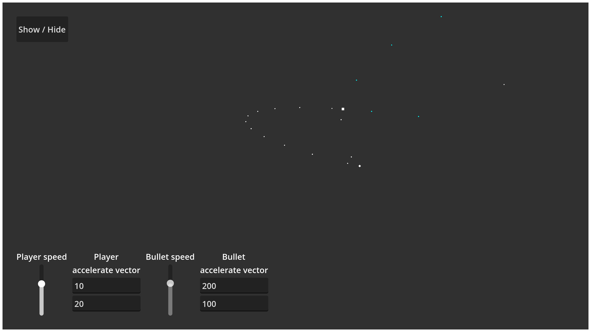

# Ballistic Deflection Calculator
Ballistic deflection calculator is a tool for calculating the shot vector considering speeds and accelerations for Godot.

## Methods
```gdscript
Array[float] times_to_hit_vector2(projectile_speed: float, to_target: Vector2, target_velocity: Vector2 = Vector2(0, 0),
	projectile_acceleration: Vector2 = Vector2(0, 0), target_acceleration: Vector2 = Vector2(0, 0)) static
Array[float] times_to_hit_vector3(projectile_speed: float, to_target: Vector3, target_velocity: Vector3 = Vector3(0, 0, 0),
	projectile_acceleration: Vector3 = Vector3(0, 0, 0), target_acceleration: Vector3 = Vector3(0, 0, 0)) static
Array[float] times_to_hit_vector4(projectile_speed: float, to_target: Vector4, target_velocity: Vector4 = Vector4(0, 0, 0, 0),
	projectile_acceleration: Vector4 = Vector4(0, 0, 0, 0), target_acceleration: Vector4 = Vector4(0, 0, 0, 0)) static
Array[Vector2] velocities_vector2(projectile_speed: float, to_target: Vector2, target_velocity: Vector2 = Vector2(0, 0),
	projectile_acceleration: Vector2 = Vector2(0, 0), target_acceleration: Vector2 = Vector2(0, 0)) static
Array[Vector3] velocities_vector3(projectile_speed: float, to_target: Vector3, target_velocity: Vector3 = Vector3(0, 0, 0),
	projectile_acceleration: Vector3 = Vector3(0, 0, 0), target_acceleration: Vector3 = Vector3(0, 0, 0)) static
Array[Vector4] velocities_vector4(projectile_speed: float, to_target: Vector4, target_velocity: Vector4 = Vector4(0, 0, 0, 0),
	projectile_acceleration: Vector4 = Vector4(0, 0, 0, 0), target_acceleration: Vector4 = Vector4(0, 0, 0, 0)) static
Vector2 velocity_from_time_to_hit_vector2(time_to_hit: float, to_target: Vector2, target_velocity: Vector2 = Vector2(0, 0),
	projectile_acceleration: Vector2 = Vector2(0, 0), target_acceleration: Vector2 = Vector2(0, 0)) static
Vector3 velocity_from_time_to_hit_vector3(time_to_hit: float, to_target: Vector3, target_velocity: Vector3 = Vector3(0, 0, 0),
	projectile_acceleration: Vector3 = Vector3(0, 0, 0), target_acceleration: Vector3 = Vector3(0, 0, 0)) static
Vector4 velocity_from_time_to_hit_vector4(time_to_hit: float, to_target: Vector4, target_velocity: Vector4 = Vector4(0, 0, 0, 0),
	projectile_acceleration: Vector4 = Vector4(0, 0, 0, 0), target_acceleration: Vector4 = Vector4(0, 0, 0, 0)) static
```

## Example
```gdscript
const BULLET_SCENE: PackedScene = preload("res://.../bullet.tscn")
var bullet_speed: float = 300


func shoot(target: CharacterBody2D) -> void:
	var to_target: Vector2 = target.global_position - global_position

	var bullet_velocities: Array[Vector2] = BDC.velocities_vector2(bullet_speed, to_target, target.velocity)

	if bullet_velocities.size() == 0:
		print("impossible to hit the target")
		return

	var bullet: CharacterBody2D = BULLET_SCENE.instantiate()
	bullet.global_position = global_position
	bullet.velocity = bullet_velocities[0]

	get_parent().add_child(bullet)
```

## Demo
You can test the add-on using the included demo scene.


## Dependencies
[RES - Real Equation Solver](https://github.com/neclor/godot-real-equation-solver)

## How it works?
[Formula](docs/Formula.md)
