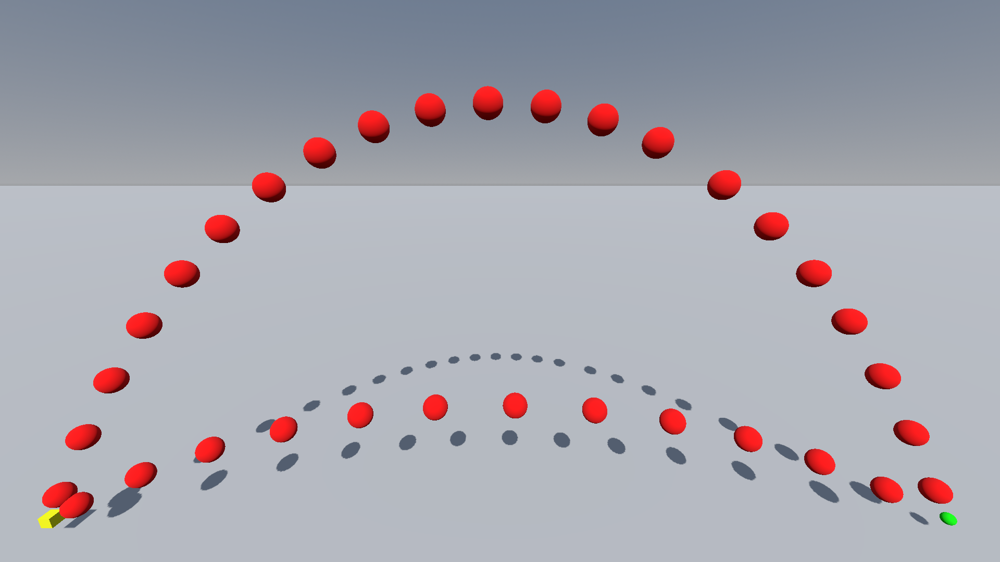
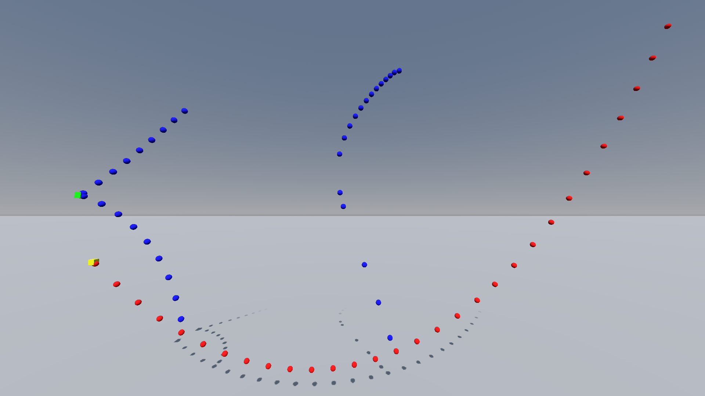
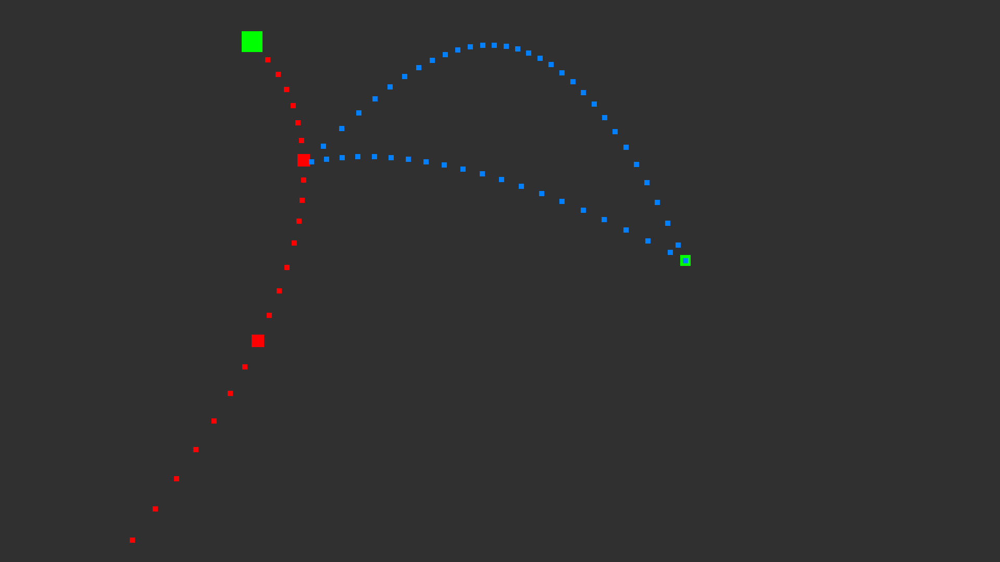
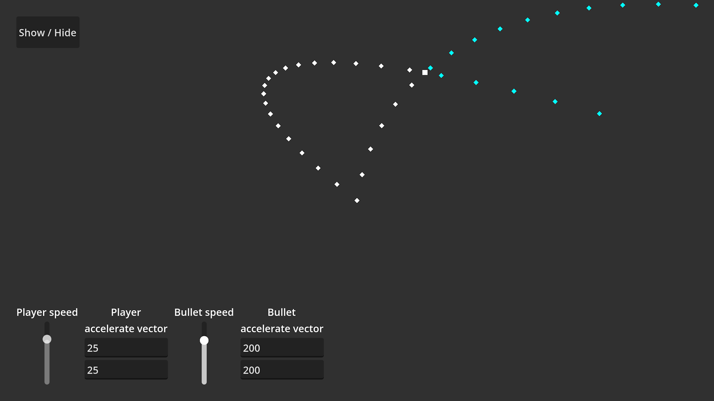

# Ballistic Solutions

Ballistic solutions for moving targets: interception time, position, and firing velocity, accounting for projectile and target acceleration.

---

## Table of Content

1. [Download](#download)
2. [Quickstart](#quickstart)
3. [Warning](#warning)
4. [GDScript](#gdscript)
5. [C#](#c)
6. [Demo](#demo)
7. [Contributing](#contributing)
8. [How it Works ?](#how-it-works)

---

## Download

- [NuGet Package](https://www.nuget.org/packages/BallisticSolutions)
- [Asset Store](https://store.godotengine.org/asset/neclor/ballistic-solutions/)
- [GitHub](https://github.com/neclor/ballistic-solutions)

---

## Quickstart

1. Install the addon.
2. Compute the vector to the target:
    ```gdscript
    var to_target = target.global_position - global_position
    ```
3. Call `BsVelocity*D.best_by_speed` to get initial projectile velocity.
4. Instantiate your projectile and assign `velocity`.

---

## Warning

**Godot Physics Consideration:**  
Godot applies linear damping to physics bodies by default, which gradually reduces object velocity.
This can significantly affect ballistic accuracy if not properly accounted for.

**Recommendations:**
- Set `default_linear_damp = 0` in the project settings, if you want pure projectile motion
- Test thoroughly with your specific physics settings

---

## [GDScript](README_GDSCRIPT.md)

---

## [C#](README_CSHARP.md)

---

## Demo
You can test the addon using the included demo scene.






---

## Contributing

- Contributions are welcome. Open an issue or PR.
- Demo scene is included for testing. Run it in Godot to validate behavior.

---

## How it Works ?

- The library sets up an interception equation between target and projectile motion and solves for `t`.  
- Each positive solution `t` corresponds to a valid hit time and gives a required initial velocity.  
- If no positive solutions exist, interception is impossible with current parameters.

See detailed [Mathematical report](docs/mathematical_report.md).

---
