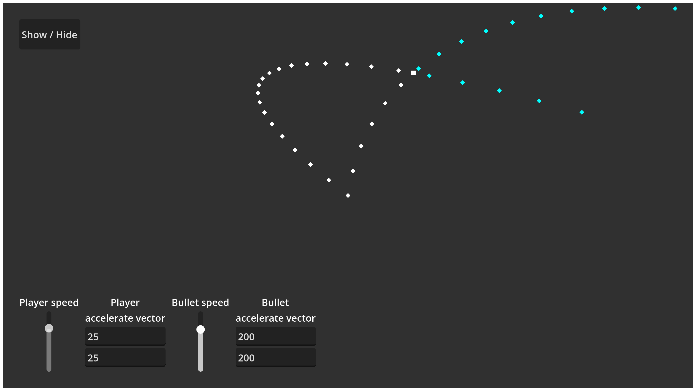

# Ballistic Solutions

**Ballistic Solutions** is a library for calculating interception times, impact positions, and firing vectors,
taking into account the velocities and accelerations of both projectile and target.  

---

## Table of Contents
1. [Quickstart](#quickstart)
2. [Warning](#warning)
3. [GDScript](#gdscript)
4. [C#](#csharp)
5. [Demo](#demo)
6. [Contributing](#contributing)
7. [How it Works ?](#how-it-works)

---

## <a name="quickstart"></a>Quickstart

1. Install the addon in Godot or reference the DLL in your C# project.
2. In your scene, compute the vector to the target:
    ```gdscript
    var to_target = target.global_position - global_position
    ```
3. Call `best_firing_velocity` to get initial projectile velocity.
4. Instantiate your projectile and assign `velocity` and `acceleration`.

---

## <a name="warning"></a>Warning

**Godot Physics Consideration:**  
Godot applies linear damping to physics bodies by default, which gradually reduces object velocity.
This can significantly affect ballistic accuracy if not properly accounted for.

**Recommendations:**
- Set `default_linear_damp = 0` in the project settings, if you want pure projectile motion
- Test thoroughly with your specific physics settings

---

## <a name="gdscript"></a>[GDScript](README_GDSCRIPT.md)

---

## <a name="csharp"></a>[C#](README_CSHARP.md)

---

## <a name="demo"></a>Demo
You can test the addon using the included demo scene.




---

## <a name="contributing"></a>Contributing

- Contributions are welcome. Open an issue or PR.
- Demo scene is included for testing. Run it in Godot to validate behavior.

---

## <a name="how-it-works"></a>How it Works ?

- The library sets up an interception equation between target and projectile motion and solves for `t`.  
- Each positive solution `t` corresponds to a valid hit time and gives a required initial velocity.  
- If no positive solutions exist, interception is impossible with current parameters.

See detailed [Formula documentation](docs/how_it_works.md).

---
