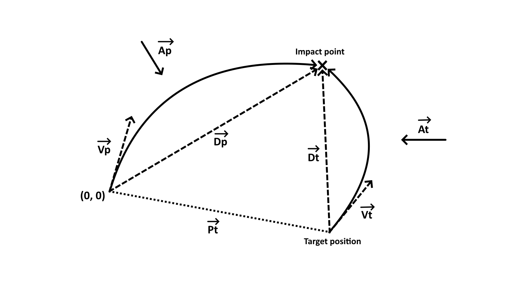

# How it works ?

---

## Variables:
$$
\begin{align*}

& v = |V_p| - \text{Projectile speed} \\
& \hat{V_p} - \text{Projectile direction vector} \\
& V_p = \hat{V_p} v - \text{Projectile veloctity vector} \\
& A_p - \text{Projectile acceleration vector} \\
& D_p - \text{Projectile displacement vector} \\
\\ 
& P_t - \text{Vector to realtive target position} \\
& V_t - \text{Target velocity vector} \\
& A_t - \text{Target acceleration vector} \\
& D_t - \text{Target displacement vector} \\
\\
& t - \text{Time to hit}\\
\\
& A = A_p - A_t - \text{Relative acceleration vector} \\

\end{align*}
$$

---

## General formulas:

$$
\begin{align*}

D_p &= V_p t + \frac{A_p t^2}{2} = t (V_p + \frac{A_p t}{2}) \\
D_t &= V_t t + \frac{A_t t^2}{2} = t (V_t + \frac{A_t t}{2}) \\
D_p &= P_t + D_t \\
\\
V_p^2 &= v^2 \\
\\
V_p t + \frac{A_p t^2} {2} &= P_t + V_t t + \frac{A_t * t^2}{2} \\
\\
\hat{V_p} v = V_p &= \frac{P_t}{t} + V_t - \frac{A t}{2}

\end{align*}
$$

---

## Finding time

$$
\begin{align*}

\text{If we know projectile speed } v = |V_p| \text{ we can find time:} \\
\\
V_p^2 = v^2 \\ 
V_p = \frac{P_t}{t} + V_t - \frac{A t}{2} \\
\\
(\frac{P_t}{t} + V_t - \frac{A t}{2})^2 = v^2 \\
(\frac{A t^2}{2} - V_t t - P_t)^2 - v^2 t^2 = 0 \\
(\frac{A^2}{4}) t^4 + (-A V_t) t^3 + (V_t^2 - A P_t - v^2) t^2 + (2 V_t P_t) t + P_t^2 = 0 \\
\text{We need to solve this equation of 4th degree.}

\end{align*}
$$

---

## Finding position

$$
\begin{align*}

\text{By substituting time into the formula we find the impact position $D_p$ :} \\
\\
D_p = P_t + D_t \\
D_p = P_t + t (V_t + \frac{A_t t}{2})

\end{align*}
$$

## Finding velocity vector

$$
\begin{align*}

\text{To find the velocity vector you need to substitute time into the formula :} \\
\\
V_p = \frac{P_t}{t} + V_t - \frac{A t}{2}

\end{align*}
$$

---

## Finding speed knowing direction vector

$$
\begin{align*}

\hat{V_p} v t = P_t + V_t t - \frac{A t^2}{2} \\
v = \hat{V_p} \frac{P_t}{t} + \hat{V_p} V_t - \hat{V_p} \frac{A t}{2} \\
\\
R(t) = P_t + V_t t - \frac{A t^2}{2}\\
\text{Intersection is possible only if $R(t)$ lies along $\hat{V_p}$} \\
R(t) - \hat{V_p} (\hat{V_p} \cdot R(t)) = 0 \\
\\
(\frac{A - (\hat{V_p} \cdot A) \hat{V_p}}{2}) t^2 - (V_t - (\hat{V_p} \cdot V_t) \hat{V_p}) t - (P_t - (\hat{V_p} \cdot P_t) \hat{V_p}) = 0 \\
\\
B = A - (\hat{V_p} \cdot A) \hat{V_p} ​\\
C = V_t - (\hat{V_p} \cdot V_t) \hat{V_p}​ \\
D = P_t - (\hat{V_p} \cdot P_t) \hat{V_p} \\
\frac{B}{2} t^2 − C t − D = 0
\\
(\frac{B^2}{4}) t^4 - (B C) t^3 + (C^2 - B D) t^2 + (2 C D) t + D^2 = 0 \\

\end{align*}
$$

